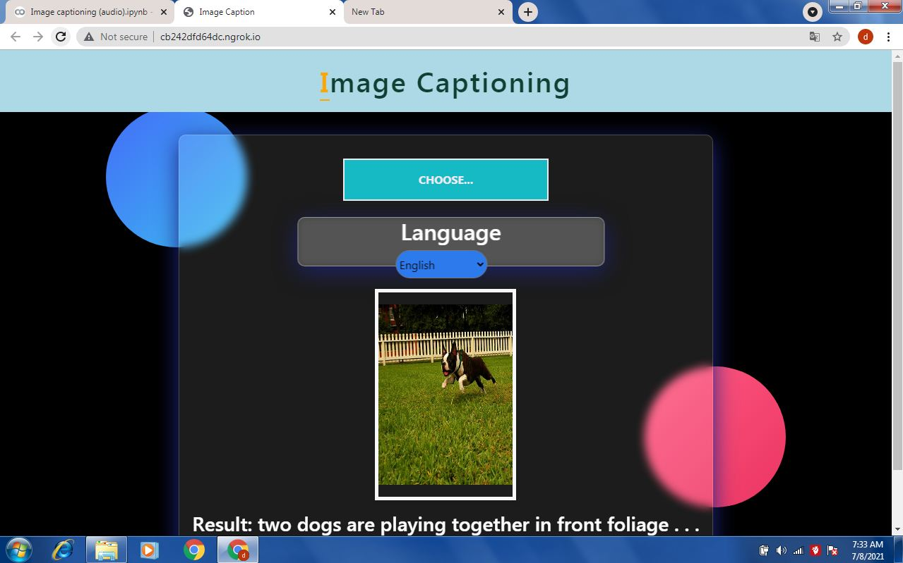
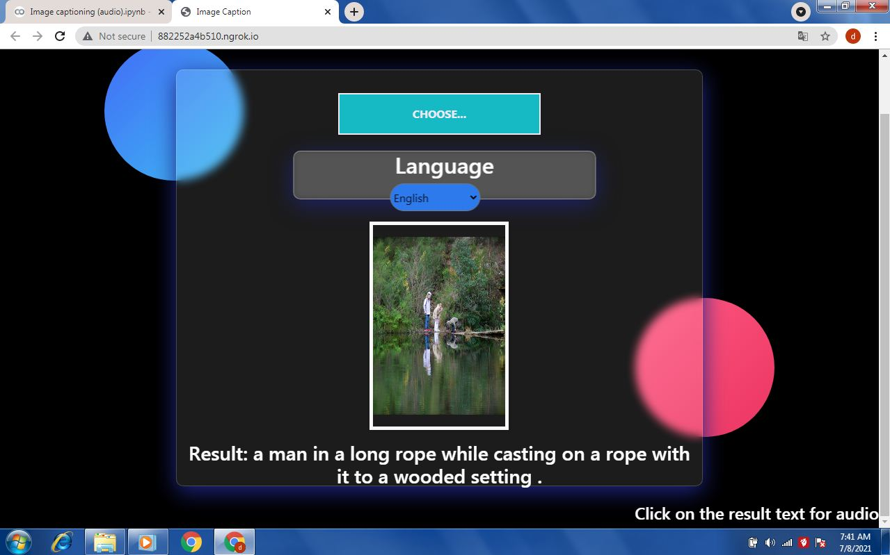
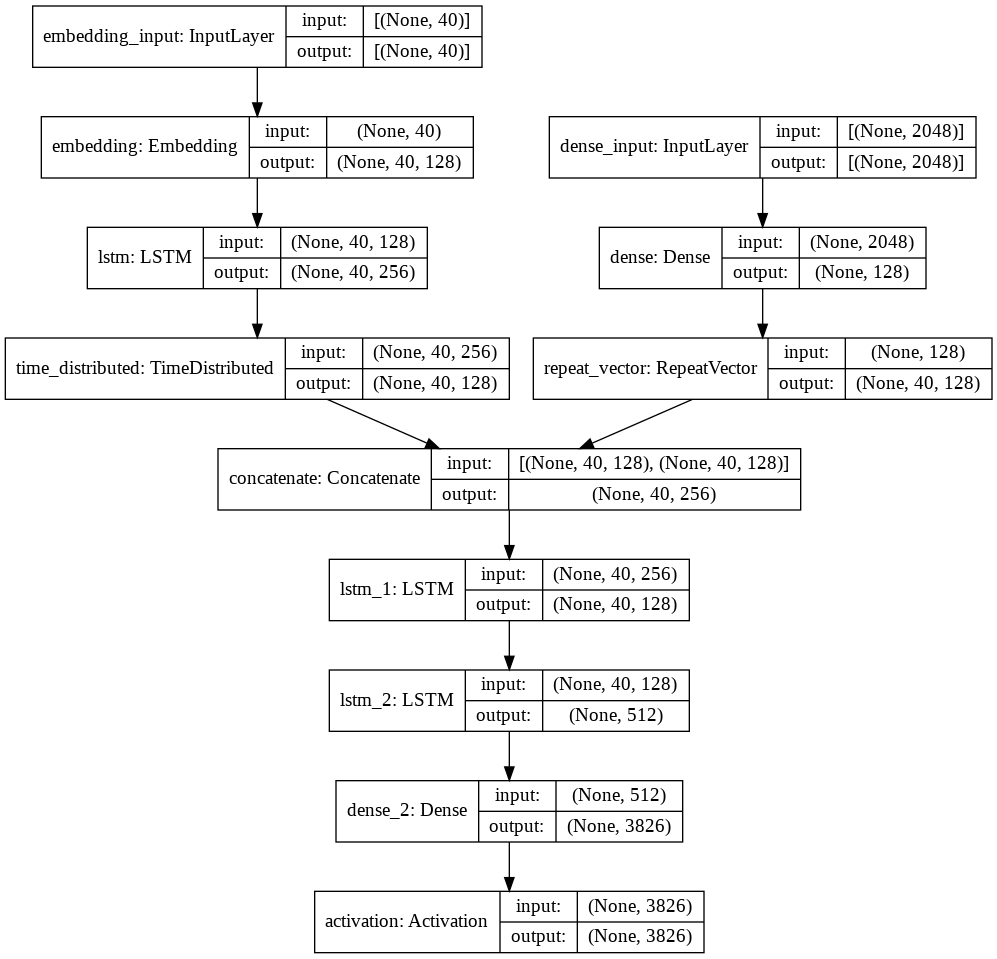
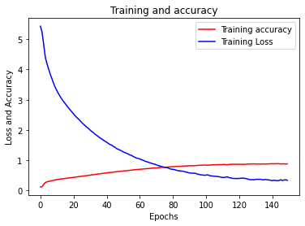

# Image-Captioning

# Problem
Image caption Generator is a research area of Artificial Intelligence that deals with image understanding and a language description for that image. Generating well-formed sentences requires both syntactic and semantic understanding of the language. Being able to describe the content of an image using accurately formed sentences is a very challenging task, but it could also have a great impact, by **helping visually impaired people better understand the content of images**. 

# Flask Demo
I have made a flask web app in which I have used google translate API to convert into the captions into different languages and Flask gtts to convert the captions into audio
 
 
 

 

 

# Approach
This problem uses an Encoder-Decoder model. Here encoder model will combine both the encoded form of the image and the encoded form of the text caption and feed to the decoder.
Our model will treat CNN as the ‘image model’ and the RNN/LSTM as the ‘language model’ to encode the text sequences of varying length. The vectors resulting from both the encodings are then merged and processed by a Dense layer to make a final prediction.Create a merge architecture in order to keep the image out of the RNN/LSTM and thus be able to train the part of the neural network that handles images and the part that handles language separately, using images and sentences from separate training sets. 
Below is the architecture of our model

# Results
Due to memeory issues the model is trained on 1300 images with 150 epochs and got a accuracy around 89%

# Reference
This [github repository](https://github.com/zhjohnchan/awesome-image-captioning) contains comprehensive collection of deep learning research papers from all premier conferences of image captioning and related area.
